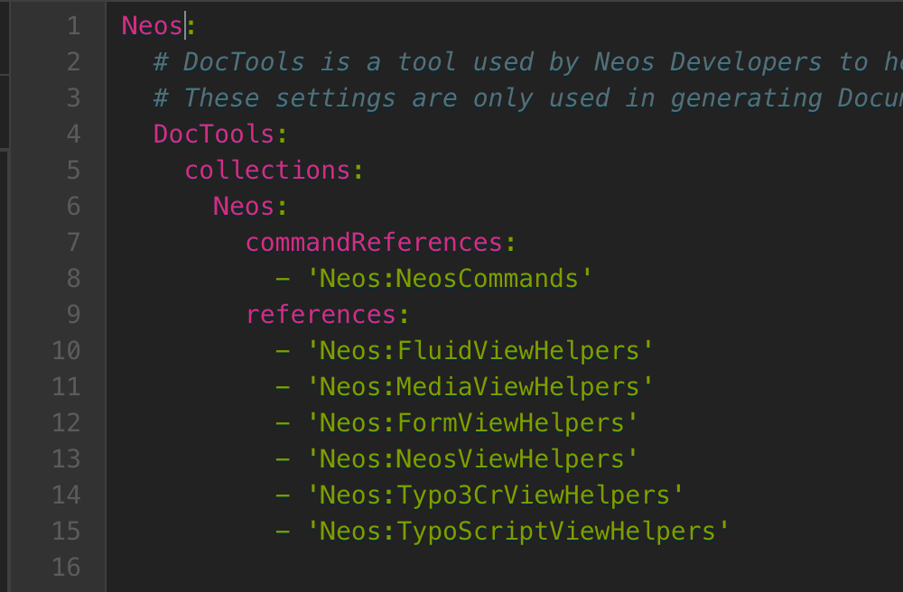
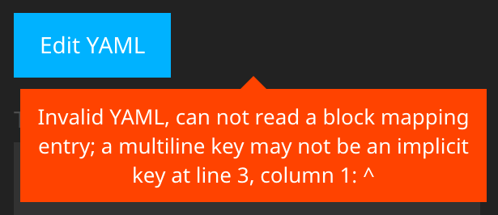

# Flownative Neos Editors

This package is home to additional editors (and validators) for use with
[Neos](https://www.neos.io/).

## Installation

`composer require flownative/neos-editors`

## Usage

To use the included editors, simply configure your property accordingly
in `NodeTypes.yaml`. Here is an example:

    properties:
      'yamlProperty':
        type: 'string'
        ui:
          label: 'YAML property'
          inspector:
            group: 'document'
            editor: 'Flownative.Neos.Editors/Inspector/Editors/Yaml'
        validation:
          'Flownative.Neos.Editors/Inspector/Validators/Yaml': []

## Available Editors

### YAML

Name: `Flownative.Neos.Editors/Inspector/Editors/Yaml`

The YAML editor provides syntax highlighting for YAML and makes sure no
tab characters are used for indentation.

The editor supports `buttonLabel` as an `editorOption`, like the
`CodeEditor` in Neos.

## Available Validators

### YAML

Name: `Flownative.Neos.Editors/Inspector/Validators/Yaml`

The YAML validator provides validation of YAML. Internally it tries to
parse using [JS-YAML](https://github.com/nodeca/js-yaml) and fails
validation if that throws an exception.

The validator has no options.
